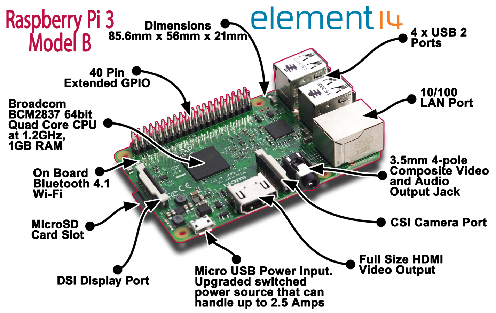
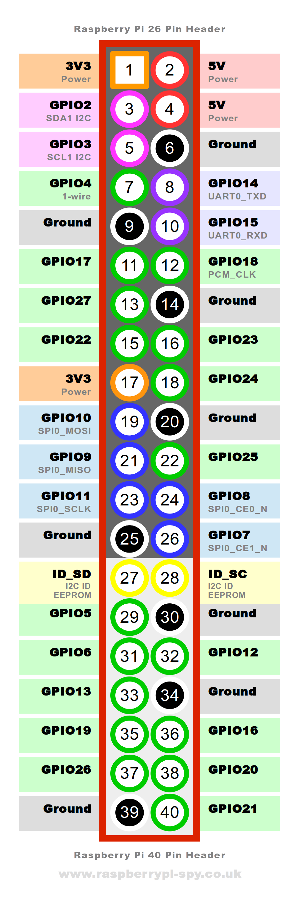
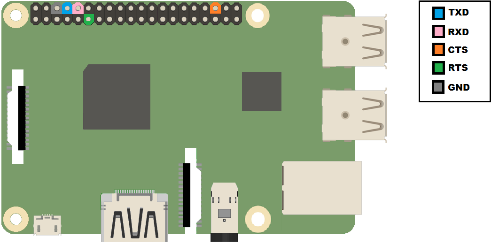
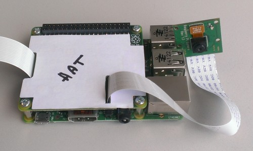
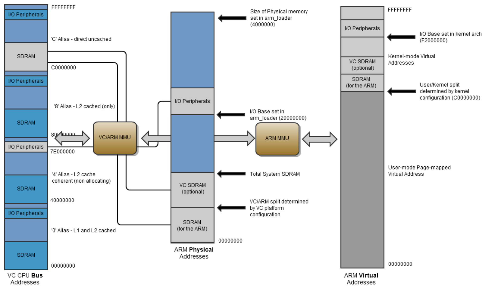
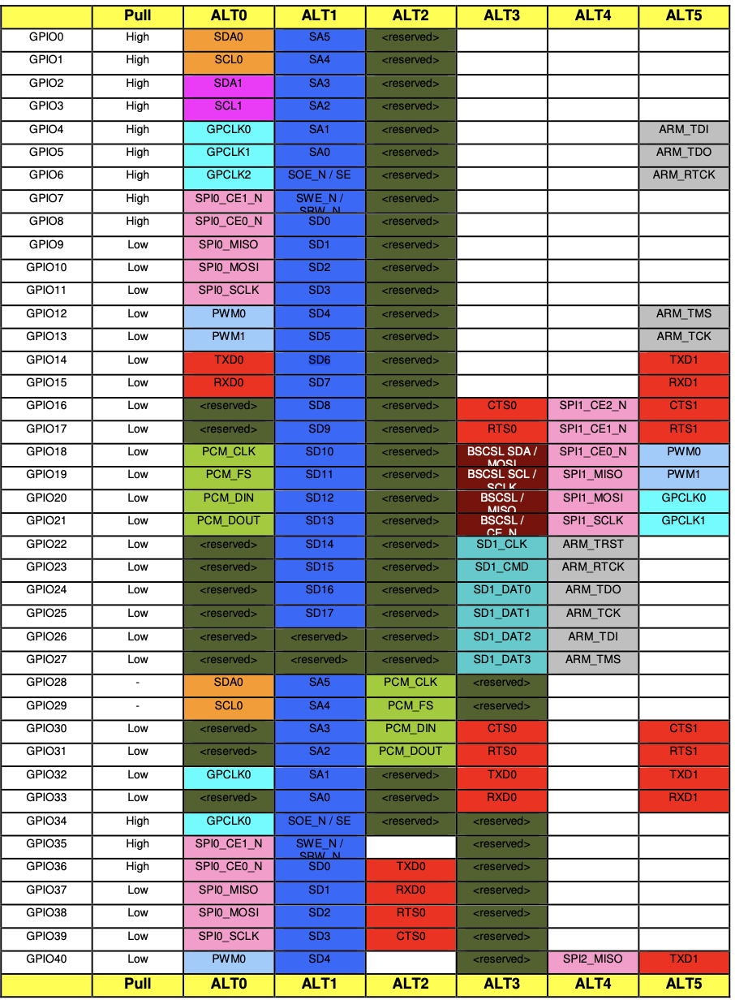
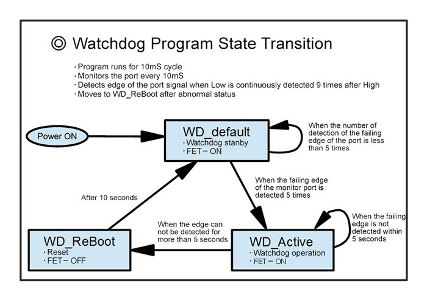

## Readings

- cortex-a53 - ARM **2019** 年發布的 **ARMv8-A** 64 位指令集
  - ARMv8-A 的相關資訊參考 http://wiki.csie.ncku.edu.tw/embedded/ARMv8
- 學習樹莓派
  - https://sites.google.com/site/raspberypishare0918/home
- [成大資工 wiki](http://wiki.csie.ncku.edu.tw/_categories)
  - SPI
    - http://wiki.csie.ncku.edu.tw/embedded/SPI

  - I2C
    - http://wiki.csie.ncku.edu.tw/embedded/I2C
- 系統性的介紹
  - https://ithelp.ithome.com.tw/users/20129818/ironman/3852?page=1
- 如何連接 I2C EEPROM
  - https://coldnew.github.io/f0528f55/
- 分析 GPIO 40 pin
  - https://maker.pro/raspberry-pi/tutorial/raspberry-pi-4-gpio-pinout
- 規格書
  - https://cs140e.sergio.bz/docs/BCM2837-ARM-Peripherals.pdf
- raspberry pi os 實作介紹
  - https://s-matyukevich.github.io/raspberry-pi-os/
- C++ implementation
  - https://github.com/bztsrc/raspi3-tutorial
- ARM kernel 初始化的執行流程
  - http://www.wowotech.net/armv8a_arch/arm64_initialize_1.html


## Environment

- Raspberry Pi 3 Model B+
- macOS


## Structure

raspberry pi 3 B+ 實體圖片：


比較完整的架構圖：



Model B 與 B+ 的長相差不多，而上圖的版子是 B，下面部分的詳細資料是 B+：

- 整個板子大小 (h x w x d) 為 56.5 x 85.6 x 17
- 處理器 (processor) - Broadcom **BCM2837B0**
  - 64-bit
  - Quad Core (4 核)
  - 1.4 GHz (時脈, 每秒指令數)
  - Arm Cortex-A53
- RAM
  - 1G
  - 跟 CPU 在同個 chip (也許稱作 on-chip RAM ?)
- MicroSD (Secure Digital) Card Slot
  - 用來放 MicroSD 卡
  - MicroSD 為 Flash memory
  - OSDI 給的 MicroSD 牌子為 SanDisk Ultra，規格為：
    - 16GB
    - micro SDHC
- DSI  Display Port (Display Serial Interface)
  - 多用來連接觸控 LCD 小螢幕
- CSI (Camera Serial Interface) Carmera Port
  - 連接相機與處理器
- Bluetooth - 實際 B+ 的規格是 4.2 & BLE
  - BLE - Bluetooth Low Energy
- IEEE 802.11.b/g/n/ac，2.4GHz/5GHz 無線 LAN (WIFI)
- 40 Pin GPIO
  - GPIO - General-purpose input/output
- HDMI Video output
- 10/100/1000 LAN
- 4 個 USB 2.0 port
- power 為 5V/2.5A USB，透過 macro USB 電源供應器


除此之外還有附上一條 USB 轉 TTL 的頭：

- TTL (Transistor-Transistor Logic) - 一種邏輯閘數位積體電路，由電阻器和電晶體而組成，主要透過電壓的不同產生 0 or 1 的資料
- 需要注意在透過線連接 raspberry 的 PIN 腳與 TTL serial converter (USB to TTL 頭有 PIN 腳的地方) 時，一邊要接 TX 而另一邊要接 RX


---

### SD card

- 根據大小可以分成三種：

  - SD - < 2GB

  - SDHC - 4GB ~ 32GB

  - SDXC - > 64GB

- 存取速度有兩種表達方式：

  - UHS - 標示為 **U**
    - 通常有 U1、U3，數字越大速度越快
      - U1 - 10 MB/s
      - U3 - 30 MB/s
  - Speed Class - 標示為 Class **C**
    - 常見的四種規格 (2、4、6、10)，數字越大速度越快
      - C2 - 2 MB/s
      - C10 - 10 MB/s
    - 數字會被 Ｃ 包起來


### 40 pin GPIO



- 3V3 - 3.3 V (VDC)
  - 配合電流 500mA
- 5V
  - 配合電流 1.5A
- PCM_CLK
  - Pulse-code Modulation
  - 將類比訊號 (連續的) 轉為數位訊號 (離散的)
  - 提供 clock signal 給外部 audio 裝置

- 其他介紹：
  - http://wiki.csie.ncku.edu.tw/embedded/GPIO
  - https://pinout.xyz/pinout/




- P.S. 在 GPIO 40 PIN 上面沒有標示 RTS / CTS PIN
  - **RTS (Require ToSend，傳送請求)** 為輸出訊號，用於指示本裝置準備好可接收資料，低電平有效，低電平說明本裝置可以接收資料
  - **CTS (Clear ToSend，傳送允許)** 為輸入訊號，用於判斷是否可以向對方傳送資料，低電平有效，低電平說明本裝置可以向對方傳送資料
  - RTS (AUX_MU_MCR_REG)  / CTS register (AUX_MU_MSR_REG) 的對應欄位設為 0，代表高電平 --> disable
  - RTS (USART_RTS) / CTS (USART_CTS) 用硬體來做 flow control；rx / tx 用軟體做 flow control


#### I2C

- Inter-Intergrated Circuit
- 有兩條傳輸線路
  - SDA - 傳輸資料 (serial data)
  - SCL - 提供時脈 (serial clock)
- 一個 master 與多個 slave 的架構
- 傳輸過程：
  1. 進入 start condition (S)：master 把 SDA 拉低，此時 SCL 持續處於高電位，代表在接下來 SCL 變低時就要傳送資料
  2. SDA 傳輸資料時跟著 SCL 走，當 SCL 為高電位時，傳送 SDA 的高低狀態。又可細分為
     - 傳送 7 bits 位址 - master 在進入 start condition 後，會傳 7 bits data 給 slave，代表要讀寫的 slave
     - 第八個 bit - 決定 master 讀或寫
     - Slave ACK 確定 - 收到的 slave 會回傳 ACK 一次，方法為 slave 拉低 SDA
     - 傳輸資料 - 讀寫雙方相同，都是一方調整電壓時，一方讀取電壓資訊。每 8 bits 會確定一次狀態，如果是 master 寫，slave 就要送 ACK；slave 寫，master 會傳 **ACT**
     - 資料結束 - master 送給 slave 時，slave 直到 master 傳 ACK 前都不能停；而 master 為接收者時，要停只需要傳 NA 給 slave 即可
  3. 進入 STOP condition： SCL 先高，然後 SDL 在高
- `[ ]` 內表示 slave 送的，則流程可以簡化為：
  - master ---> slave - `S Addr W [A] Data0 [A] Data1 [A] ... [A] dataN [A] P`
  - slave ---> master - `S Addr R [A] [Data0] A [Data1] A ... A [dataN] NA P`
- I2C ID EEPROM - 採用 I2C 通訊格式的 EEPROM，主要透過兩條控制線控制，分別為資料線 SDA 及時脈線 SCL
  - EEPROM (Electrically Erasable Programmable Read-Only Memory) - 一種可以通過電子方式多次複寫的半導體儲存裝置
  - 而 ID_SD / ID_SC PIN 能夠讓 raspberry pi 去連接 I2C EEPROM，並進行自動設定 GPIOs 與 drivers；EEPROM 本身包含板子的資訊、GPIO 的資訊以及 device tree，而 device tree 讓 Linux 能自動載入需要的 drivers
  - HATs (Hardware Attached on Top) - 一個 add-on board (附加板)，其包含一個系統，該系統允許 B+ 識別連接的 HAT 並自動配置板的 GPIO 和驅動程序
  - 
    - [introduction](https://www.raspberrypi.com/news/introducing-raspberry-pi-hats/)
    - [spec](https://github.com/raspberrypi/hats)
  
- 其他介紹：
  - https://elinux.org/images/1/1e/I2C-SPI-ELC-2020.pdf


#### UART

- Universal Asynchronous Receiver Transmitter
- 用來做 serial 資料傳送/接收的晶片
  - TxD - transmit data
  - RxD - receive data
- Raspberry Pi 3B+ 中 UART：
  - 有三種功能：
    - 內部藍芽使用
    - 控制終端 (serial console)
    - 與其他設備進行 serial communication
  - 有兩個 UART：
    - PL011 UART (`/dev/ttyAMA0`)
    - mini UART (`/dev/ttys0`)
  - 有兩個 serial port：
    - serial0 - GPIO port，為 GPIO 14 (pin 8)、GPIO 15 (pin 10)
    - serial1 - 藍芽
- Rpi3 一共有兩個 UART： mini UART / PL011 UART
  - PL011 UART (BCM2837 P. 175) - an ARM based UART
    - connected to the On-board Bluetooth module

  - mini UART
    - used for Linux console output

  - 參考： https://harttle.land/2017/01/14/raspberrypi-uart.html#header-1


baudrate 算法：

```c
#define SYSTEM_CLOCK_FREQ 250 * 1000 * 1000 // 300 MHz
#define BAUDRATE (SYSTEM_CLOCK_FREQ / (8 * (baudrate_reg + 1) ))
```

- system clock freq 來源參考 https://elinux.org/BCM2835_datasheet_errata，雖然 BCM2837 是 400 MHz，mini UART 只有用 250 MHz。這邊指的 system clock 是 VPU (VideoCoreIV 的 GPU) 的，而不是 CPU 的 (1.4 GHz)：
  


#### SPI

- Serial Peripheral Interface Bus
- 使用全雙工溝通，模式為一個主機 (master) 對上一 or 多個從機 (slave)
- 一共有四個 logical signal interface：
  - SCLK (Serial Clock) - 串列時脈，由主機發出
  - MOSI (Master Output, Slave Input) - 主機輸出從機輸入訊號（資料由主機發出）
  - MISO (Master Input, Slave Output) - 主機輸入從機輸出訊號（資料由從機發出）
  - SS (Slave Select) - 片選訊號，由主機發出，一般是低電位有效
    - 在 40 pin GPIO 的名稱似乎為 CE0 / CE1 (Chip Enable)


## 規格書筆記

>規格書當中只有第一頁寫到 BCM2837，但整體內容跟 BCM2835 相同


SDRAM

- synchronous dynamic random-access memory
- DRAM + 同步 (sync) 和雙區域 (Dual Bank) 的功能



- BCM2835 為 VideoCore 的架構，ARM CPU 是其中一個 coprocessor
  - VideoCore 為 GPU 的架構，可以想成就是顯卡
  - 最少的 GPU memory 要 32 MB
- virtual kernel space 為 0xC0000000 and 0xEFFFFFFF
- virtual user space 為 0x00000000 and 0xBFFFFFFF
- physical 的 0x3F000000 to 0x3FFFFFFF 是給 peripherals
- 軟體若要透過 DMA engine 存取 RAM，需要使用 bus address (0xC0000000)
- BCM2835 使用 AMBA AXI-compatible (Advanced eXtensible Interface) interface structure，而 BCM2835 AXI system 其架構的關係並不能確保讀取資料的順序，因此要加 barrier


## ARM

### Instruction

- MRS (system coprocessor register to ARM register) - Move to ARM register from system coprocessor register
- `CBZ` (Compare and Branch on Zero)
- `CBNZ` (Compare and Branch on Non-Zero)
- `WFI` - wait for Interrupt，進入睡眠模式等待 interrupt
- `WFE` - Wait for Event
- `ADR register, exper` - 於 PC 的相對偏移的地址值讀到 register 中的偽指令 (pseudo instruction)
- `LDR Rd,=label` - 偽指令，做
  - 把 label 放到 literal pool (embedded system 放 constant 的地方)
  - 從 literal pool 讀此值放到 register

- `b` - 直接 jmp
- `bl` - call function (把 return addr 放到 lr 內)
- `CPSID` - Interrupt disable
- `CPSIE` - interrupt enable


### Registers

- MPIDR_EL1 - Multiprocessor Affinity Register
  - Aff0 [7:0] - Indicates the core number in the Cortex-A53 processor
  - https://developer.arm.com/documentation/ddi0500/j/System-Control/AArch64-register-descriptions/Multiprocessor-Affinity-Register
- xzr - zero register


## Others

- link script 當中的 `KEEP` 告訴 linker 要 keep 特定的 section，即使該 section 當中沒有 symbols 被 reference


## Lab0

### helpful commands

```shell
# source code to object file
## 使用 cross toolchains 編譯 ARM
aarch64-unknown-linux-gnu-gcc -c a.S
## 也可以使用 llvm 來做
clang -mcpu=cortex-a53 --target=aarch64-rpi3-elf -c a.S

# object file to executable
## by cross toolchains
aarch64-unknown-linux-gnu-ld -T linker.ld -o kernel8.elf a.o
## by llvm
ld.lld -m aarch64elf -T linker.ld -o kernel8.elf a.o

# executable to kernel image
## dump the .text section data
aarch64-unknown-linux-gnu-objcopy -O binary kernel8.elf kernel8.img
llvm-objcopy --output-target=aarch64-rpi3-elf -O binary kernel8.elf kernle8.img

## run the qemu
## linux (machine type is raspi3)
qemu-system-aarch64 -M raspi3 -kernel kernel8.img -display none -d in_asm
## macOS (machine type is raspi3b)
qemu-system-aarch64 -M raspi3b -kernel kernel8.img -display none -S -d in_asm

# debug with qemu
qemu-system-aarch64 -M raspi3b -kernel kernel8.img -display none -S -s
## with mini UART
qemu-system-aarch64 -M raspi3b -kernel kernel8.img -serial null -serial stdio -display none -S -s
## in pwndbg
pwndbg> file kernel8.elf
pwngdb> target remote :1234
```


下載含有 [filesystem 的 kernel image](https://github.com/GrassLab/osdi/raw/master/supplement/nctuos.img)，把檔案內容直接寫到 device 裡面：

```shell
# 找 usb device 為哪一個
df -h

# 先嘗試
sudo umount /dev/disk2s1
# 如果說在 busy
sudo diskutil unmount /dev/disk2s1 # or diskutil unmountDisk disk2

# 從隨身碟 copy 出來
sudo dd if=/dev/rdisk2 of=/tmp/test.img bs=1m
# 寫到隨身碟內
sudo dd if=nctuos.img of=/dev/rdisk2 bs=1m

# macOS
## P.S. 如果失敗了要 umount 重來一次
## FAT32 屬於 MS-DOS file system
sudo mount -t msdos /dev/disk2s1 share

# 做完相關操作後 umount
sudo umount share
sudo diskutil unmountDisk /dev/disk2
```

- P.S. /dev/disk2s1 是分區，/dev/disk2 是 block device，/dev/rdisk2 是 raw device (使用 raw 模式存取)
  - rdisk2 的讀寫速度會比 disk2 快數十倍


因為沒有提供電源供應器，因此要接上 **5V 的 PIN 腳** (5V 看 raspberry 原本的電源供應器的電壓)。接完 cable 並插入 USB 後，與 raspberry 互動的步驟如下：

```shell
# macOS
# screen <device> <baud_rate>
## default baud rate is 115200
screen /dev/tty.usbserial-0001 115200

# detach
<control-a> <d>
# attach to detached session
screen -d -r
# exit
<control-a> <k>
```

- 會出現兩個 devices：
  - `/dev/tty.usbserial-0001` - incoming call
    - callin device
  - `/dev/cu.usbserial-0001` - outgoing call
    - callout device
    - cu - calling unit
  - 其實兩個都可以用


參考資源：

- [attaching-raspberry-pis-serial-console-uart-debugging](https://www.jeffgeerling.com/blog/2021/attaching-raspberry-pis-serial-console-uart-debugging)


## Lab1

### Goals

- [x] Initialize rpi3 after booted by bootloader
- [x] Following UART to set up mini UART
- [x] Implement a simple shell supporting the listed commands
- [ ] Get the hardware’s information by mailbox and print them, you should at least print board revision and ARM memory base address and size
- [x] Add a \<reboot\> command.


### Detail

UART

- Raspberry Pi 可以將資訊輸出到 serial console，技術上被稱作 UART (Universal Asynchronous Receiver/Transmitter)
- 通常 SoC 都會有 UART header，為  3/4 個可以連接 RS-232 standard 的 pins 
  - RS-232 為一個廣泛用於電腦序列介面 (serial interface) 外設連接的一個標準

GPIO

- mini UART and PL011 UART 都會使用 GPIO 14, 15 PIN，而使用 mini UART 的話要設置 ALT5、 PL011 UART 則是設 ALT0
  - GPIO 14 - ALT0 是 TX0、ALT5是 TX1 (UART1 == mini UART)
  - GPIO 15 - ALT0 是 RX0、ALT5是 RX1
  - ALT 可以用來調整 PIN 腳的功能：
    
- 需要設置 pull up/down register 來 disable GPIO，是因為 GPIO pins 使用 alternate functions 而不是一般的 input-output
  - 調整 pull up / down 以及相關資訊可以參考： https://www.arduino.cn/thread-13186-1-1.html
  - 下圖當 switch 接起時是低電位 (ground == 低電位)，而沒接的時候是高電位 (pull-up，電阻一端接 + or VCC)
    
    反之下圖 switch 接起來的時候是高電位，沒接是低電位 (pull-down，電阻一端接 - or GND)
    
    P.S. logic gate 就是 Raspberry Pi 的 GPIO pin，主要功能是用來維持基準電位的，避免程式出現 floating 狀態 (一下 LOW / 一下 HIGH)
    - 參考 http://www.cjwind.idv.tw/pull-up-and-pull-down-resistor/
  - MPU - Microcontroller unit，一顆完整的MCU，會將CPU、RAM、ROM、I/O 或A/D等周邊關於記憶與運算功能整合在一起

Watchdog

- Watchdog timer board，是一個內建的 countdown timer GPIO monitors，主要是用來監視程式是否運作正常、監控 GPIO
- 正常情況下，軟體若向 GPIO 發送脈衝訊號，就會重置 IC 中的計時器；如果發生錯誤而導致沒有送訊號，就會重新啟動
- 執行流程如下圖：
  
- 能透過 Power Management (**PM_** prefix)，對應的位址照理說可以在 bcm2837 的 document 上看到，不過好像沒有
  - https://github.com/ultibohub/Core/blob/master/source/rtl/ultibo/core/bcm2837.pas#L76 這裡有滿詳細的位址資訊
  - RSTS register / RSTC register，猜測是 reset status 跟 reset controller
- https://micro.rohm.com/tw/deviceplus/how-tos/raspberrypi-guide/raspberry-pi-auto-reboot-using-watchdog-board/

Mailbox

- Mailbox 是一個 ARM 與 VideoCoreIV GPU 之間的溝通方式，一共由三個 component 所建構： registers、channels、messages

  - register - 直接透過 MMIO 存取，而這次作業只需要：

    - Mailbox 0 的 Read/Write (CPU read from GPU)

    - Mailbox 0 的 status (check GPU status)

    - Mailbox 1 的 Read/Write (CPU write to GPU)

    - ```
      Mailbox Read/Write Peek  Sender  Status    Config
         0    0x00       0x10  0x14    0x18      0x1c
         1    0x20       0x30  0x34    0x38      0x3c
      ```

  - channel - Mailbox 0 定義一些 channels，而 channel 8 是用來做 CPU->GPU 的溝通，GPU 就是 VideoCore

    - 0: Power management
    - 1: Framebuffer
    - 2: Virtual UART
    - 3: VCHIQ
    - 4: LEDs
    - 5: Buttons
    - 6: Touch screen
    - 7:
    - 8: Property tags (ARM -> VC)
    - 9: Property tags (VC -> ARM)

  - message - 要交換的資料

- 資料格式為：

  - Mailbox messages: mbox array 的 28-bit MSB 與 channel 的 4-bit LSB
  - Buffer contents:
    - u32: buffer size in bytes (including the header values, the end tag and padding)
    - u32: buffer request/response code
      - Request codes:
        - 0x00000000: process request
        - All other values reserved
      - Response codes:
        - 0x80000000: request successful
        - 0x80000001: error parsing request buffer (partial response)
        - All other values reserved
    - u8...: sequence of concatenated tags
    - u32: 0x0 (end tag)
    - u8...: padding
  - Tag format:
    - u32: tag identifier
    - u32: value buffer size in bytes
    - u32:
      - Request codes:
        - b31 clear: request
        - b30-b0: reserved
      - Response codes:
        - b31 set: response
        - b30-b0: value length in bytes
    - u8...: value buffer
    - u8...: padding to align the tag to 32 bits
  - Mailbox0 Register 結構： https://github.com/ultibohub/Core/blob/master/source/rtl/ultibo/core/bcm2837.pas#L2115
    - mailbox1 的 read 同時也是 mailbox 0 的 write

- [Document](https://github.com/raspberrypi/firmware/wiki/Mailboxes)

DLAB bit 存在於 `AUX_MU_LCR_REG`，如果為 1 的話就可以透過第一個 Mini Uart 的 register 來存取 baudrate register，但是在做 operation 時這個 bit 會被清掉。實際上存取 baudrate 可以直接用 `AUX_MU_IO_REG`，因此這個可以直接設為 0。


Makefile

- Example：

  ```
  targets : prerequisites
          recipe
          …
  ```

  - 如果沒有 prerequisites，就會去看 `target` 是否存在而不執行
  - Rules without Recipes or Prerequisites
    - 如果 rule 沒有 prerequisites，並且 `target` 不存在，在生成 `target` 後如果沒有更動 `target`，其會保持在最新的狀態，造成 `make` 沒有效果 (make: \`clean' is up to date.)
    - 被加上 `.PHONY` 的 target 會不考慮 `target` 這個檔案是否存在

- Substitution References - 將 value 換成指定的變數 (`${var:a=b}`)，舉例來說：

  ```
  foo := a.o b.o l.a c.o
  bar := $(foo:.o=.c)
  ```

  那就會去把每個詞中結尾的 `a` 置換成 `b`，的到 `bat` 為 `'bar' to 'a.c b.c l.a c.c'.`

- `FORCE` - 可以讓只要有指定 dependency 的檔案，每次就一定會執行 rule

  ```
  clean: FORCE
          rm $(objects)
  FORCE:
  ```

  - 其效力等同於 `.PHONY: clean`


SD card 的內容 format：

- MBR partition table - 紀錄有 boot 跟 rootfs
- **boot** partition: 50 MB, fat32, LBA flag
  - bootcode.bin - GPU code to start the GPU and load the GPU firmware
  - start.elf - the GPU firmware. It reads `config.txt` and enables the GPU to load and run ARM specific user code from `kernel8.img`
  - 不過 Raspberry Pi firmware files 都是 close-sourced 而且沒 document，但可以參考下面文章略知一二：
    - https://raspberrypi.stackexchange.com/questions/10442/what-is-the-boot-sequence
    - https://github.com/DieterReuter/workshop-raspberrypi-64bit-os/blob/master/part1-bootloader.md
    - https://elinux.org/RPi_Software#Overview
  - 流程大致如下：
    - 第一階段的 bootloader 會從 on-ship ROM 執行，mount FAT32 **boot** partition 讓第二階段的 bootloader (`bootcode.bin`) 可以被存取，最後將其放到 L2 cache
    - 第二階段的 bootloader 的目標為開啟 SDRAM，並且載入 **GPU firmware** 的 bootloader (`start.elf`)
      - 在先前更新當中，`loader.bin` 的工作被 `bootcode.bin` 所取代，[commit log](https://github.com/raspberrypi/firmware/commit/c57ea9dd367f12bf4fb41b7b86806a2dc6281176)
    - GPU firmware 透過 GPU 來啟動 CPU，讀取 `config.txt` 後根據內容載入設定，除此之外還會讀 `cmdline.txt`, `bcm2835.dtb`, `cmdline.txt` 等設定檔，並用檔案 `fixup.dat` 來初始化 GPU 與 CPU 之間的 SDRAM partition，最後載入 `start.elf` 來執行
    - 最後執行 `kernel8.img`
    - P.S. 一開始的執行都是透過 **GPU** 來執行，在最後才會在 ARM 執行 `kernel.img`
- **rootfs** partition: remaining space, ext4
- 實作可以參考： http://chaotangwang.blogspot.com/2014/01/raspberry-pi-project-build-personal.html


## lab2

`config.txt`

- RPi 用 config.txt 來存系統參數，這個檔案會在 boot firmware 被讀，格式如下：

  ```
  # this is comment
  property=value
  ```

  

- 參考資料： https://www.raspberrypi.com/documentation/computers/config_txt.html
